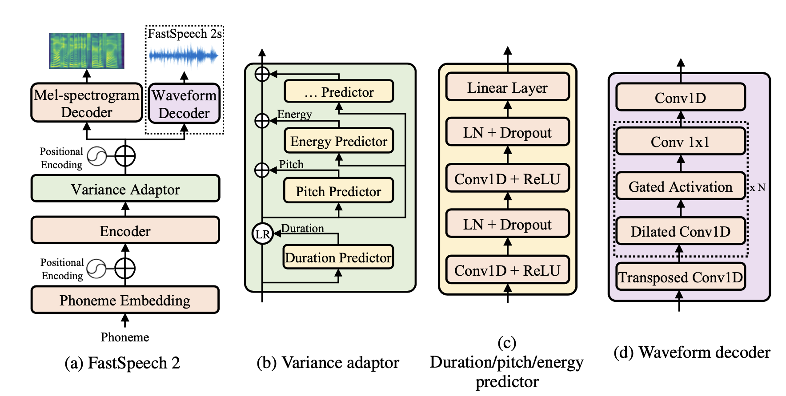

# Fastspeech 2

This repo contains a reimplementation of Fastspeech2 paper with few slight differences. Firs, we use pre-layernorm transformer architecture to ensure stability and faster convergence. Second, unlike original paper we use plain pitch embeddings for pitch adaptor instead of spectrograms obtaninded with CWT.



Note that this repo utilizes [fastspeech](https://github.com/xcmyz/FastSpeech) backbones and [waveglow](https://github.com/xcmyz/FastSpeech) vocoder.

## Inference

Set up the environment. `setup.sh` script will download and unpack dataset, pre-computed input vectors and model checkpoints.

```bash
git clone -b best_model https://github.com/Mikezz1/fastspeech2.git
pip install -r requirements.txt
sh bins/setup.sh
 ```

Run inference script:

```bash
cd vocoder
python infer.py
```

You can specify `-s`, `-p` and `-e` params to control for speed, pitch and energy of predictions. You may also change model checkpoint with `-path` param and limit the number of test text prompts with `-n` param. All the outputs will be saved to `vocoder/results` folder. Note that inference script rely on pre-trained Waveglow vocoder. Also,

## Training

To train model with pre-computed melspecs, alignments, pitch and energy vectors, simply specify name of config and run

```bash
python train.py --config='base_config'
```

If you wish to recompute input vectors, update config and use `preproccess_data.py` script. Make sure to run `get_stats.py` script afterwards to compute min/max/mean/std statistics for input vectors and manually update it in train config before running the experiment.

## Alignments

You may choose between pre-computed student model alignment and MFA alignment with `use_mfa=True` parameter in train config. MFA alignments for LJspeech dataset were obtained with [this](https://colab.research.google.com/gist/NTT123/12264d15afad861cb897f7a20a01762e/mfa-ljspeech.ipynb#scrollTo=obtWj9_wMghH) notebook. To convert phoneme-time alignments (TextGrids) to phoneme-mel alignment run `mfa_align.py` script. By default, MFA alignments are disabled.
